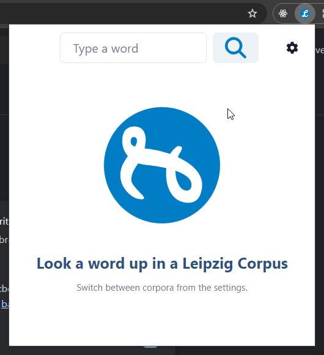
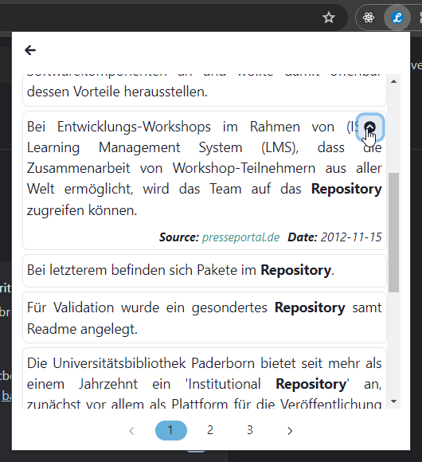
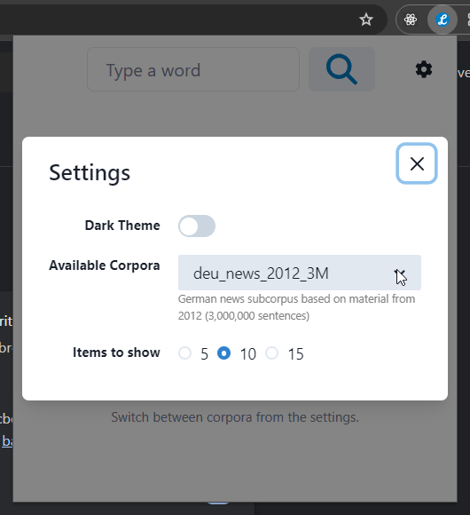
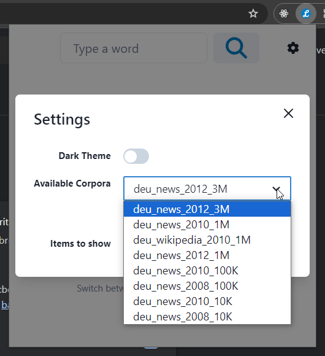

# An easier way to find how a German word is used in sentences in Leipzig Corpora

## Background
**Have you ever wondered what the gender for a "request" or a "repository" is?**

As a software developer who is a non-native German speaker, I often encounter German words that are borrowed directly from English like "repository", "tag" etc without knowing its "gender". But luckily the "gender" can be inferred from the context with the help of declensions. So by showing the word in different sentences, one can easily determine its gender with 100% confidence. Leipzig Corpora is a handy tool in such a case. Using this small extension, the user can query a word without visiting the home page of the Leipzig Corpora project but right in the extension toolbar!

## Screenshots

#### query page

#### result page

### setting page

## Installation

1. make sure `pnpm` is installed, otherwise run `npm install -g pnpm` (node version >=18.0 is recommended)
2. go to the `scr` folder and run `pnpm install` to install all the dependencies
3. run `pnpm build` or `npm run build` to build the production-ready version
4. in the chrome browser, go to `chrome://extensions` and enable `developer mode`
5. click `Load unpacked extension` and select the `dist` folder generated from step 3

## TODO
 [ ] dark mode
 [ ] user defined corpora strings

# Thanks
This extension is bootstrapped with [chrome-extension-boilerplate-react-vite](https://github.com/Jonghakseo/chrome-extension-boilerplate-react-vite?tab=readme-ov-file)
